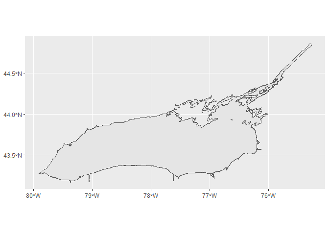

<!-- README.md is generated from README.Rmd. Please edit that file -->

# lakeontariospatial

<!-- badges: start -->
<!-- badges: end -->

The goal of lakeontariospatial is to provide common Lake Ontario
shapefiles for R users. Shapefiles have generally been imported as an sf
object and also plotted as a base ggplot2 object. The sf objects follow
the naming convention of shape\_\[area\]. The ggplot2 objects follow the
naming convention of base\_\[area\].

## Installation

You can install the development version of lakeontariospatial from
[GitHub](https://github.com/) with:

``` r
# install.packages("devtools")
devtools::install_github("tomgrizz/lakeontariospatial)
```

## Example

This is a basic example which shows you how to solve a common problem:

``` r
library(lakeontariospatial)
library(ggplot2)
#> Warning: package 'ggplot2' was built under R version 4.4.3
lake_o <- load_lake_ontario()
ggplot(lake_o) +
  geom_sf()
```


