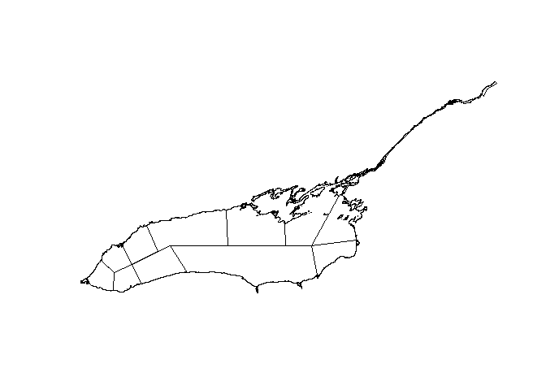

<!-- README.md is generated from README.Rmd. Please edit that file -->

# lakeontariospatial

<!-- badges: start -->
<!-- badges: end -->

The goal of lakeontariospatial is to provide common Lake Ontario
shapefiles for R users. Shapefiles have been converted to GeoPackage
(.gpkg) format using the sf package, ensuring a single-file structure
for easier management and integration. Each shapefile was read into R
with sf::read_sf() and exported to the package’s inst/extdata/ folder
using sf::st_write().

## Installation

You can install the development version of lakeontariospatial from
[GitHub](https://github.com/) with:

``` r
# install.packages("devtools")
devtools::install_github("tomgrizz/lakeontariospatial)
```

## Example

This is a basic example which shows you how to solve a common problem:

``` r
library(lakeontariospatial)
library(ggplot2)
#> Warning: package 'ggplot2' was built under R version 4.4.3
library(sf)
#> Warning: package 'sf' was built under R version 4.4.3
#> Linking to GEOS 3.13.0, GDAL 3.10.1, PROJ 9.5.1; sf_use_s2() is TRUE

lake_o <- load_lake_ontario()
ggplot(lake_o) +
  geom_sf()
```


``` r

zones <- lakeontariospatial::load_stocking_zones()
plot(st_geometry(zones))
```


